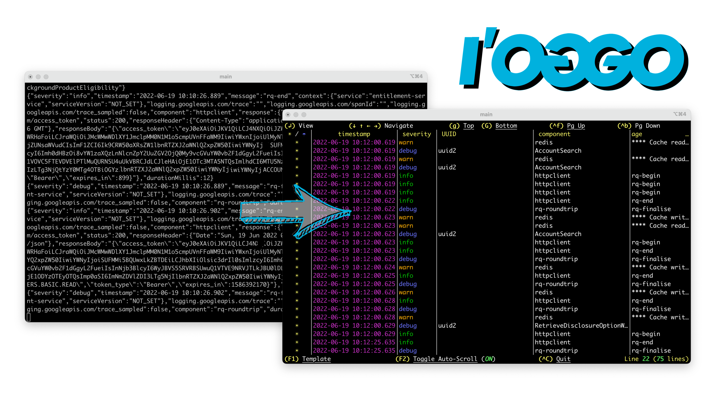
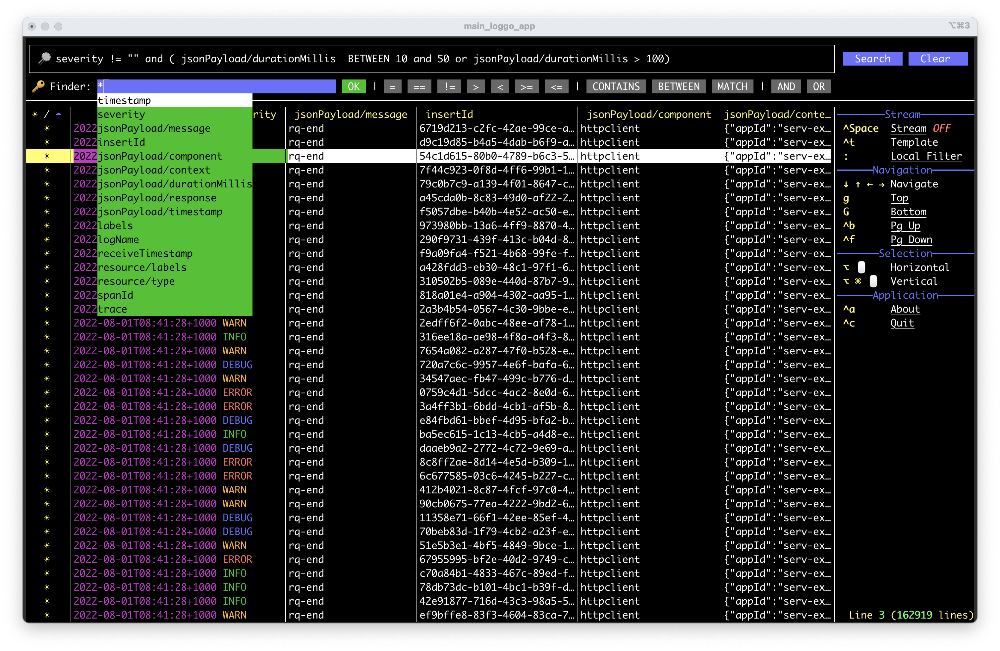
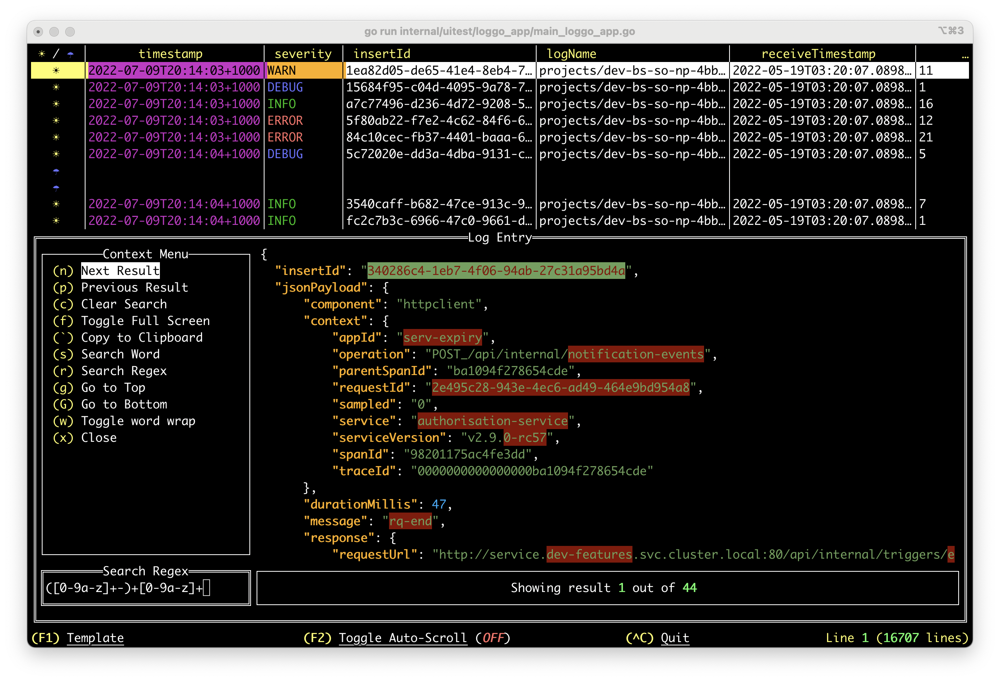
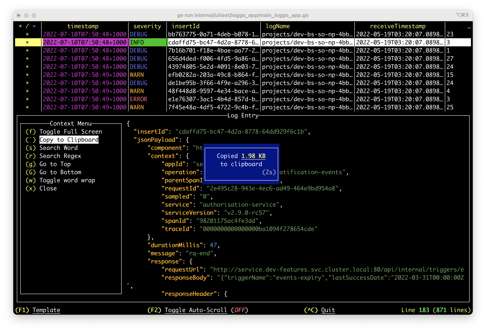
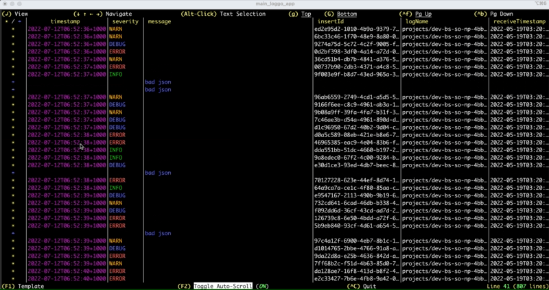
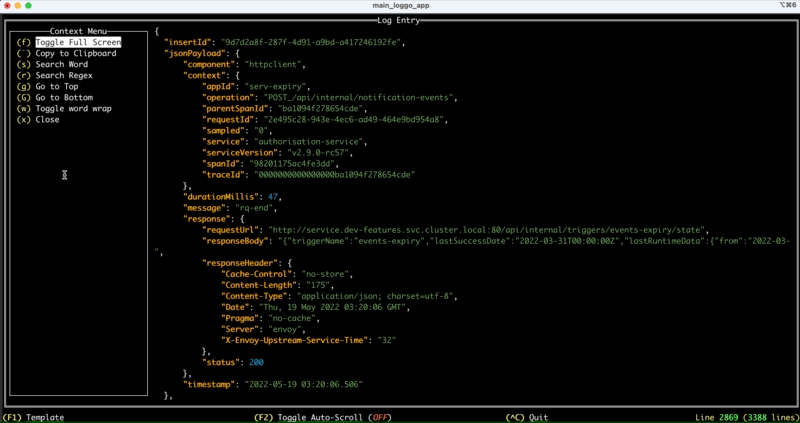
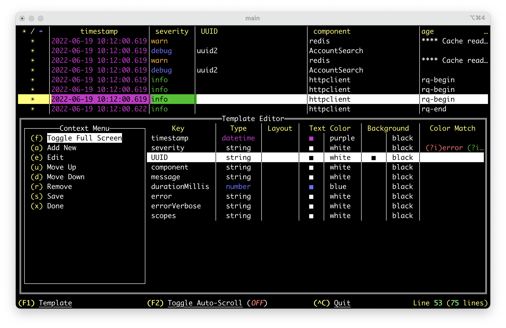
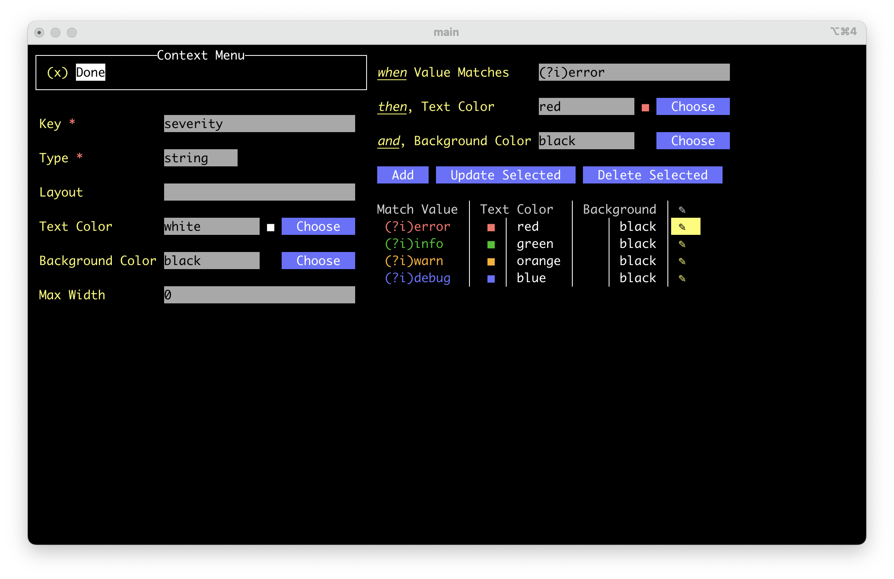
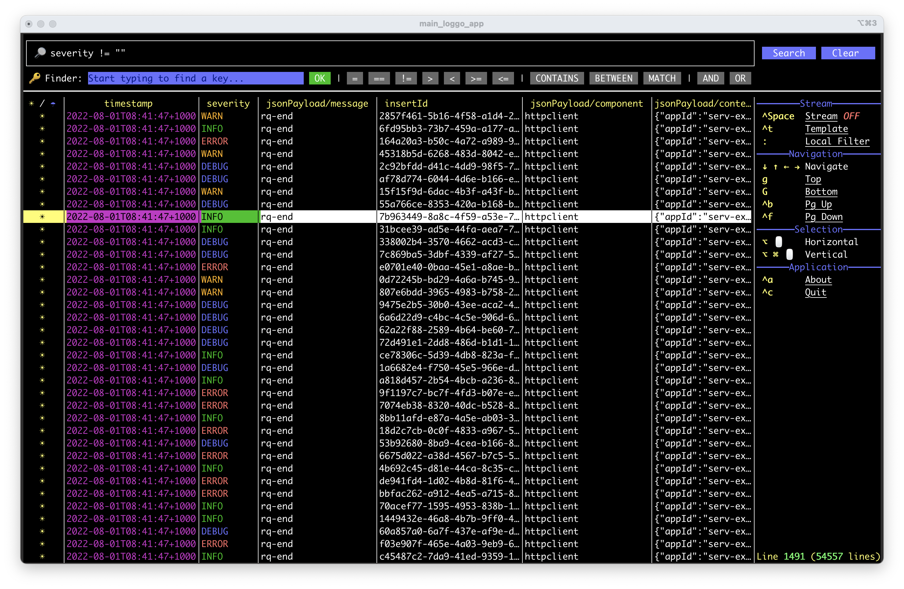
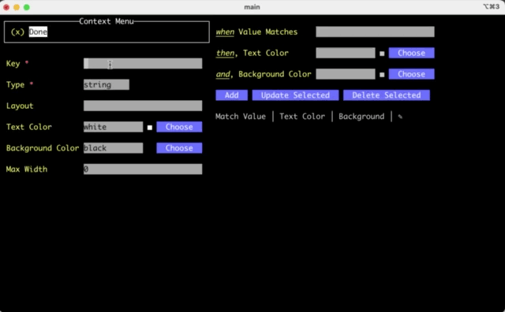

# Logovo: Rich Terminal User Interface Logging App
A fork of [Loggo](https://github.com/aurc/loggo)

[//]: # (![release]&#40;https://img.shields.io/github/v/release/aurc/loggo&#41;)

[//]: # (![release workflow]&#40;https://github.com/aurc/loggo/actions/workflows/go.yml/badge.svg&#41;)


[//]: # (![downloads]&#40;https://img.shields.io/github/downloads/aurc/loggo/total&#41;)
## Introduction

*For the impatient, go to [Getting Started](#getting-started)*

Logovo or Log on Go = 👍 is a rich Terminal User Interface app written in golang that harness the
power of your terminal to digest log streams

This can be used against applications running locally, on a Kubernetes cluster (see [K8S Cheatsheet](#k8s)), GCP
Stack Driver ([Google Logs](https://cloud.google.com/logging), see [GCP-Stream Command](#gcp-stream-command)) and many others.

some sections of readme are from upstream, to be reviewed in the future


<table>
<tr>
<td>
<p>Without Logovo</p>

</td>
<td>
<p>With Logovo</p>

</td>
</tr>
</table>

Logovo leveraged [tview](https://github.com/rivo/tview/) and [tcell](https://github.com/gdamore/tcell) projects for rich Terminal User 
Interface (TUI).

## Getting Started

[//]: # ()
[//]: # (### macOS/Linux with Homebrew/Linuxbrew:)

[//]: # (The easiest way is to utilise [Homebrew]&#40;https://brew.sh/&#41; **&#40;macOS&#41;** or [LinuxBrew]&#40;https://docs.brew.sh/Homebrew-on-Linux&#41; **&#40;Linux&#41;**)

[//]: # (package management system. Once installed simply issue the following command:)

[//]: # ()
[//]: # (````)

[//]: # (brew tap aurc/loggo)

[//]: # (brew install aurc/loggo/loggo)

[//]: # (````)

[//]: # ()
[//]: # (To update:)

[//]: # (````)

[//]: # (brew upgrade aurc/loggo/loggo)

[//]: # (````)

[//]: # ()
[//]: # (### All Systems)

[//]: # ()
[//]: # (### Install with Go)

[//]: # (Assuming you have [go]&#40;https://go.dev/&#41; installed in your system &#40;best choice if not homebrew&#41; and bin packages)

[//]: # (are in your `PATH`, just run:)

[//]: # ()
[//]: # (````)

[//]: # (go install github.com/aurc/loggo@latest)

[//]: # (````)

### Build from Source:
Including **macOS**, build from source. 
Pre-Reqs:
- [Golang](https://go.dev/) v1.21+
- Checkout the project from [https://github.com/Egor3f/loggo/](https://github.com/Egor3f/loggo/)

````
go build -o logovo
````
> Install the `logovo` binary in your system's binary bucket or add `logovo` binary to your path.

[//]: # (### Download Pre-Compiled binary)

[//]: # ()
[//]: # (This option might be suitable for you if you don't have Home/Linux-Brew or golang )

[//]: # (readly available for you. In this case you can download a pre-compiled exectuable binary)

[//]: # (for the following platforms:)

[//]: # ()
[//]: # (Latest Release [pre-build binaries here]&#40;https://github.com/aurc/loggo/releases/latest&#41;!)

[//]: # ()
[//]: # (- **Windows 11**:)

[//]: # (    )
[//]: # (   Download a `tar.gz` file from [pre-build binaries]&#40;https://github.com/aurc/loggo/releases/latest&#41; that match your platform:)

[//]: # (   - Most of PCs will be `amd64`, so file format will be like `loggo_x.y.z_windows_amd64.tar.gz`. Note: *If you own a Surface Pro, or)

[//]: # (virtualised windows on a Mac M series, you'll probably want to grab the `arm64` version.*)

[//]: # (   - Open a terminal window &#40;`cmd.exe`&#41; and issue the following command in the folder you downloaded the file:)

[//]: # (     ````)

[//]: # (     tar -xvzf loggo_x.y.z_windows_amd64.tar.gz)

[//]: # (     ````)

[//]: # (   - A file `loggo.exe` will be extracted to the current folder.)

[//]: # (   - You can place this file in a directory that's on your %PATH% so the command `loggo` is accessible from anywhere.)

[//]: # (   - )

[//]: # (- **Linux** &#40;both arm64 and amd64 plat&#41;:)

[//]: # (  - ubuntu:  `tar.gz` file from releases &#40;e.g. loggo_vx.y.z_linux_<plat>.tar.gz&#41;)

[//]: # (  - debian:  `*.deb` file from releases)

[//]: # (  - redhat:  `*.rpm` file from releases)

[//]: # (  - alpine:  `*.apk` file from releases)

## Using Logovo

Logovo can be used to stream parsed logs from a persisted file and from a 
piped input and also provides a tool for creating log templates.

### Some Features
- Local Log filtering/search
  - Main log stream remains unaffected regardless of the source (gcp, pipe, file, etc...)
  - Display only log entries that match search/filter criteria
  - Convenient key finder and operators for filter expression crafting
  
- Drill down onto each log entry
  
- Copy Log-Entry to Clipboard
  - Note: Linux requires X11 dev package. For instance, install `libx11-dev` or `xorg-dev` or `libX11-devel` to access X window system.
    
- Navigate Left-Right-Up-Down on Large Grids
  - Select a Line
  - Use the arrow keys (`↓ ↑ ← →`)
    
- Select on screen text
  - Horizontally based selection (`Alt` + Mouse `Click/Drag`)
  - Block/Vertical based selection (`Cmd`+`Opt`+ Mouse `Click/Drag` - macOS)
  - Copy the selected text to clipboard (`Cmd`+`C` - macOS/`Ctrl`+`C` - other systems)
    
- Configure Rendering Templates:
  
- Fine Tune how columns are displayed (Template):
  - Note that single Value Matches are REGEX expressions.
    

### `help` Command

To gain fine grained insight of each `logovo` command params, use
the `help` command, e.g.:
````
logovo help
logovo help stream
logovo help template
logovo help gcp-stream
````

### `stream` Command



**From File:**
````
logovo stream --file <my file>
````
*With Template:*
````
logovo stream --file <my file> --template <my template yaml>
````

**From Pipe:**
````
tail -f <my file> | logovo stream
````
Kubernetes example (See [K8S Cheatsheet](#k8s-cheatsheet))
````
kubectl logs -f -n <namespace> <pod> | logovo stream
````
*With Template:*
````
tail -f <my file> | logovo stream --template <my template yaml>
````

Note that you can pipe to anything that produces an output to the `stdin`.

### `gcp-stream` Command 
Logovo natively supports GCP Logging but in order to use this feature, there are a few caveats:
- Your personal account has the required permissions to access the logging resources.


Note: `gcp-stream` **does not** support piped commands. If you want to use piped
commands (e.g. chaining K8S output) use the `stream` command instead.

Example:
````
logovo gcp-stream \
    --filter 'resource.labels.namespace_name="some-namespace" resource.labels.container_name="some-container"' \
    --project some-project-ID \
    --from 10m
````
Where:
````
Usage:
  logovo gcp-stream [flags]

Flags:
  -p, --project string       GCP Project ID (required)
  
  ------------------- Optional Below ------------------
  
  -f, --filter string        Standard GCP filters
      --force-auth           Only effective if combined with gcloud flag. Force re-authentication even
                             if you may have a valid authentication file.
  -d, --from string          Start streaming from:
                               Relative: Use format "1s", "1m", "1h" or "1d", where:
                                         digit followed by s, m, h, d as second, minute, hour, day.
                               Fixed:    Use date format as "yyyy-MM-ddH24:mm:ss", e.g. 2022-07-30T15:00:00
                               Now:      Use "tail" to start from now (default "tail")
      --gcloud-auth          Use the existing GCloud CLI infrastructure installed on your system for GCP
                             authentication. You must have gcloud CLI installed and configured. If this
                             flag is not passed, it uses l'oggo native connector.
  -h, --help                 help for gcp-stream
      --params-list          List saved gcp connection/filtering parameters for convenient reuse.
      --params-load string   Load the parameters for reuse. If any additional parameters are
                             provided, it overrides the loaded parameter with the one explicitly provided.
      --params-save string   Save the following parameters (if provided) for reuse:
                               Project:   The GCP Project ID
                               Template:  The rendering template to be applied.
                               From:      When to start streaming from.
                               Filter:    The GCP specific filter parameters.
  -t, --template string      Rendering Template
````

For convenience, you can build a list of frequently used command parameters/flags and reuse them without
having to rewrite lengthy list of parameters, for example:

````
logovo gcp-stream \
    --filter 'resource.labels.namespace_name="some-namespace" resource.labels.container_name="some-container"' \
    --project some-project-ID \
    --from 10m
    --template /tmp/myTemplate.yaml
    --params-save mySavedParams1
````

Then you simply issue:
````
logovo gcp-stream --params-load mySavedParams1
````

If you want to review all saved params buckets, issue the following command:

````
logovo gcp-stream --params-list
````

Additionally, you might want to overwrite some parameters. The example command uses `--from 10m`, and
say you want to `tail` instead:

````
logovo gcp-stream --params-load mySavedParams1 --from tail
````

Any additional parameter provided will overwrite the loaded params at runtime.

### `template` Command
The template command opens up the template editor without the
need to stream logs. This is convenient if you want to craft
templates prior using the loggo command.

**Blank Canvas:**


````
logovo template
````

**Edit Existing Template:**
````
logovo template --file <my template yaml>
````

## K8S Cheatsheet

Combined logs of all pods of an application.
````
kubectl -n <some-namespace> logs -f deployment/<application-name> \
  --all-containers=true \
  --since=10m | logovo stream
````

Logs of a pod.
````
kubectl logs -f -n <some-namespace> <pod-name> | logovo stream
````

## Feedback

Please let us know your **thoughts**, **feature requests** and **bug reports**! Use the issues report
link here: https://github.com/Egor3f/loggo/issues
